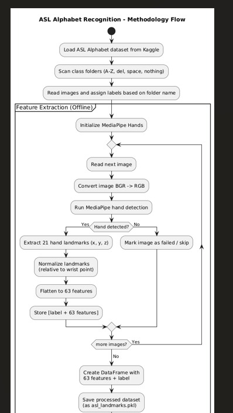
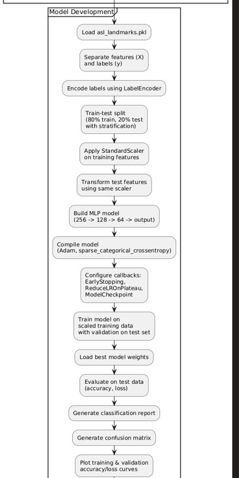
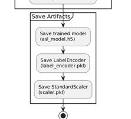

# 📊 Methodology Flowcharts

This section contains the official flowcharts that visually describe the complete methodology used in the ASL Alphabet Recognition project. These diagrams illustrate the flow of data from the dataset, through feature extraction and model training, all the way to artifact saving.

---

## 🔹 1. ASL Alphabet Recognition – Methodology Flow (Full Pipeline)

This flowchart represents the **overall methodology**, including dataset loading, folder scanning, and offline feature extraction.

---

## 🔹 2. Model Development Pipeline

This diagram shows the complete **model-building workflow**, including preprocessing, label encoding, scaling, training, evaluation, and generating reports.

---

## 🔹 3. Saving Model Artifacts

This flowchart shows how trained model components are saved for later real-time inference.

---

