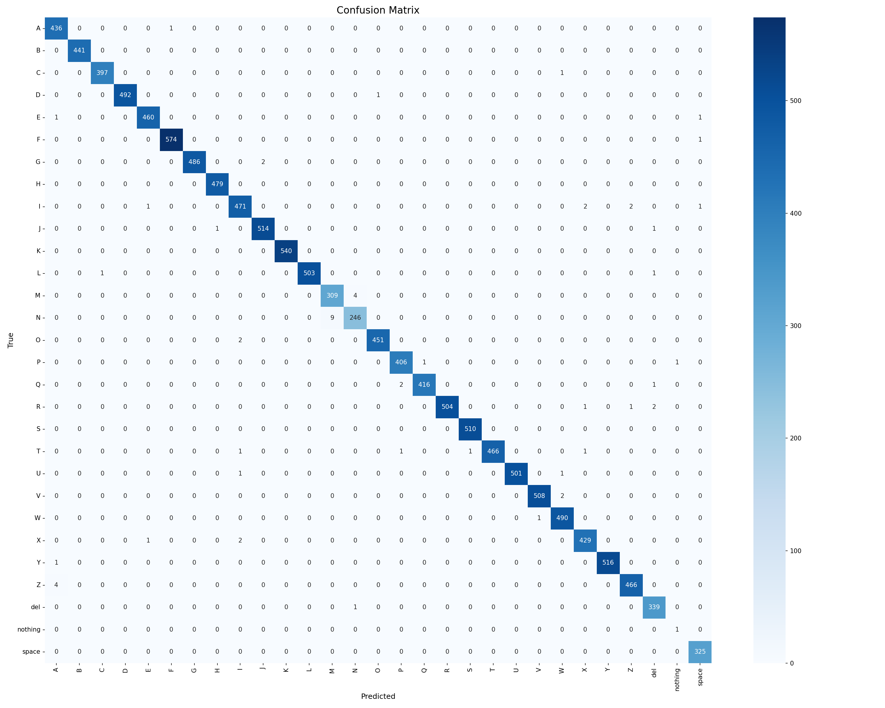
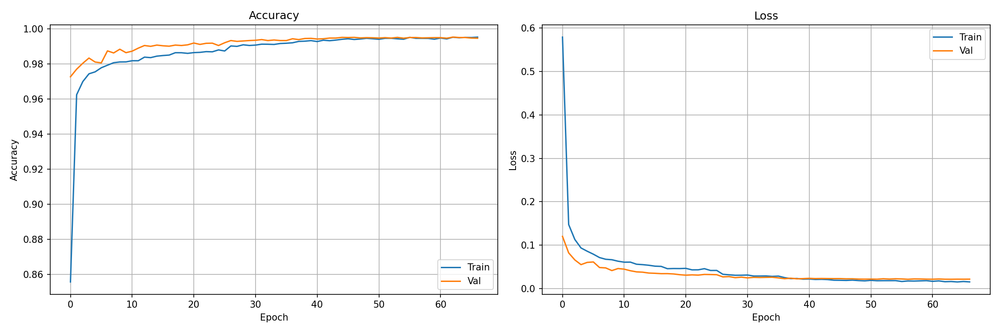
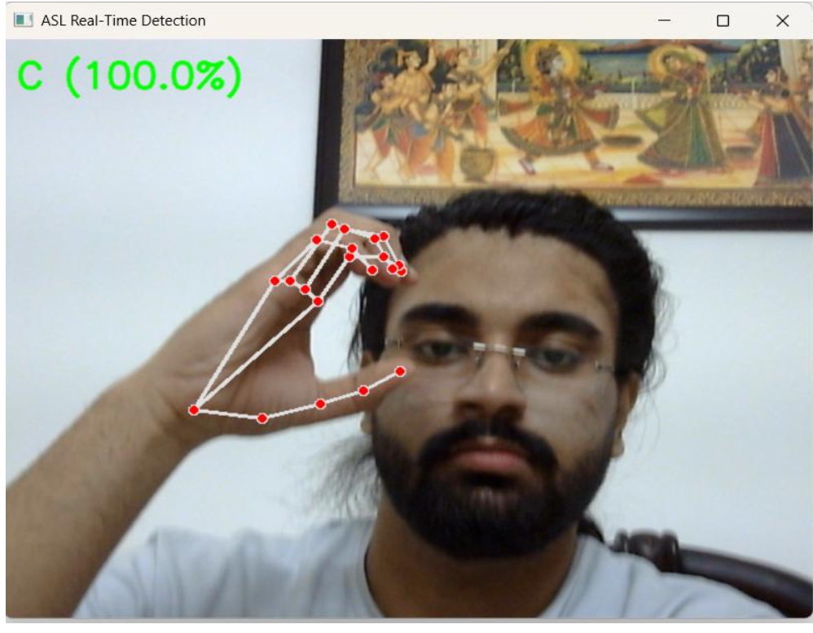
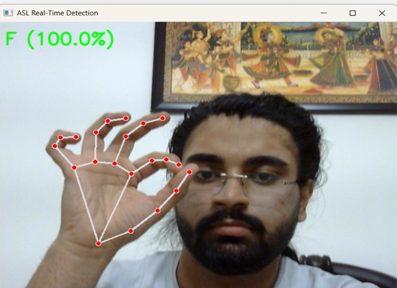
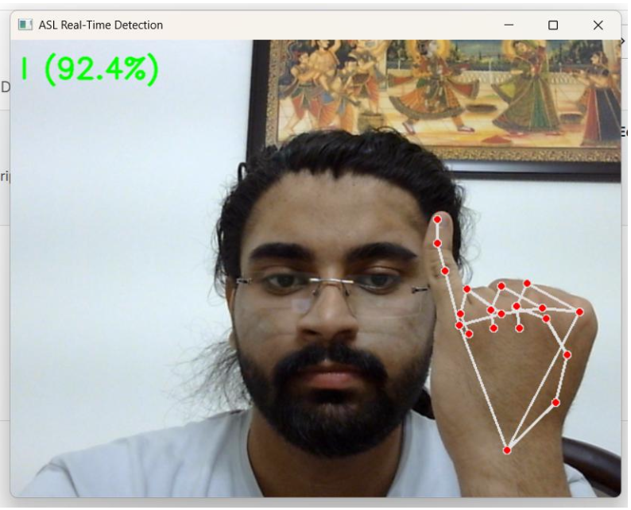

# 📈 ASL Recognition – Results

This section presents the evaluation results of the ASL Alphabet Recognition system, including the confusion matrix, training history plots, and real-time prediction screenshots.

---

## 🔹 1. Confusion Matrix

The confusion matrix shows that the classifier performs extremely well across all **29 ASL classes**, with very few misclassifications. Most values lie on the diagonal, indicating correct predictions.

### 📷 Confusion Matrix

---

## 🔹 2. Training History (Accuracy & Loss Curves)

The following plot shows the training and validation accuracy/loss curves.  
The model converges smoothly with **no overfitting**, thanks to techniques like BatchNorm, Dropout, LR scheduling, and EarlyStopping.

### 📷 Training Curves

---

## 🔹 3. Real-Time Detection Results

The following screenshots show the model detecting ASL signs **live from the webcam**.  
MediaPipe hand landmarks and the predicted alphabet are displayed in real-time with high confidence levels.

### 📷 Real-Time Detection – Screenshot 1

### 📷 Real-Time Detection – Screenshot 2

### 📷 Real-Time Detection – Screenshot 3

---

## 📌 Summary of Results

- **Training Accuracy:** 99.78%  
- **Testing Accuracy:** 99.53%  
- **Extremely low training & validation loss**  
- **High precision, recall, F1-score across all 29 classes**  
- **Successful real-time detection with smooth hand landmark tracking**  

These results confirm that the system is highly reliable and capable of accurate ASL alphabet recognition both offline and in real-time.

---

## 📁 Folder Structure Example

